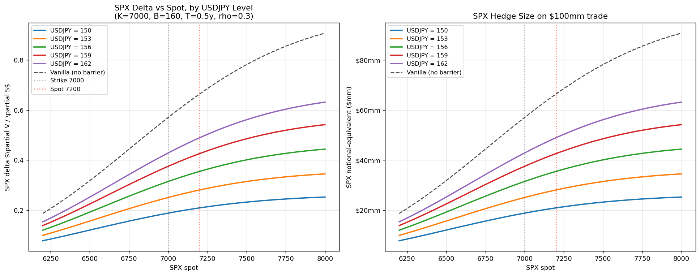
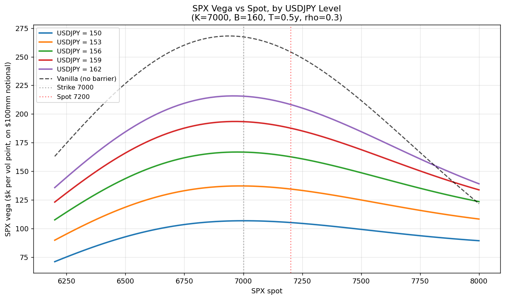
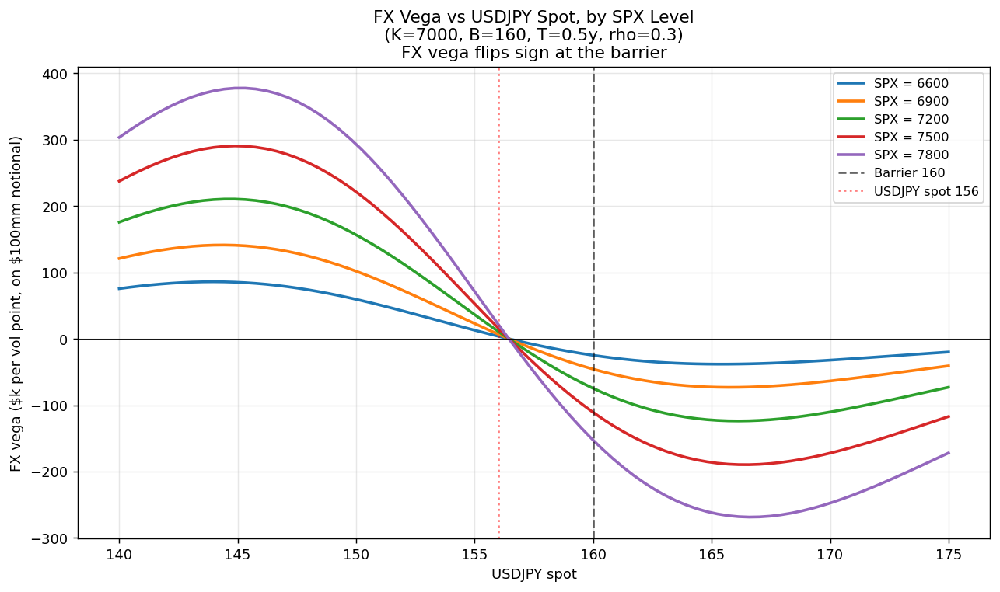
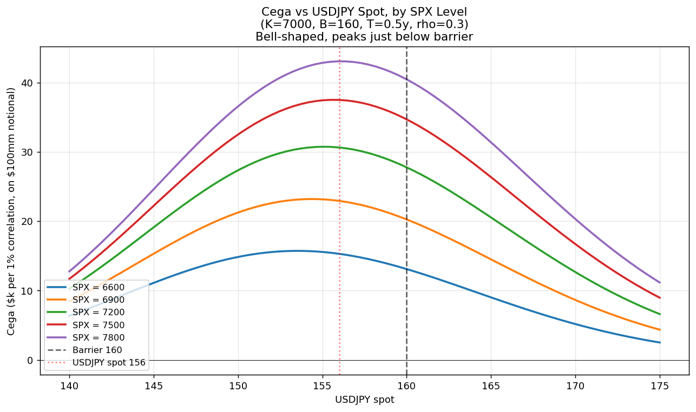
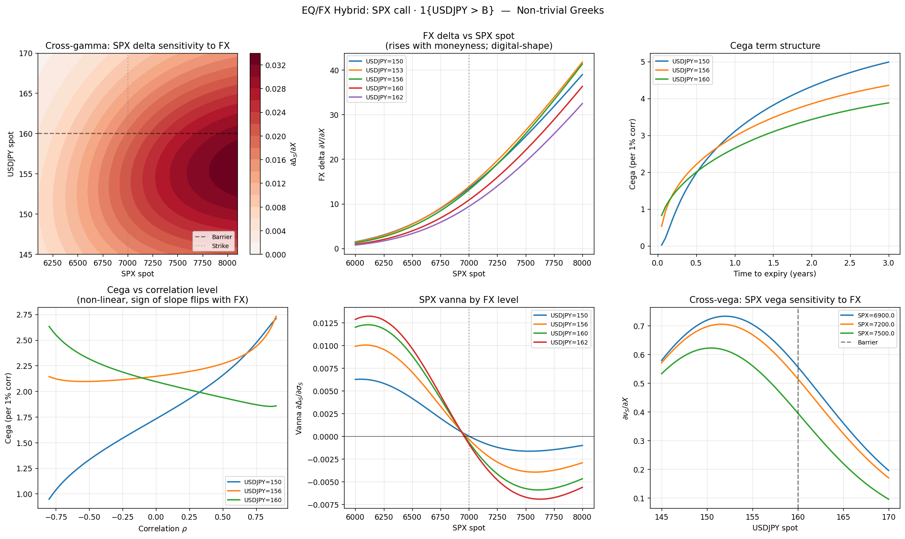
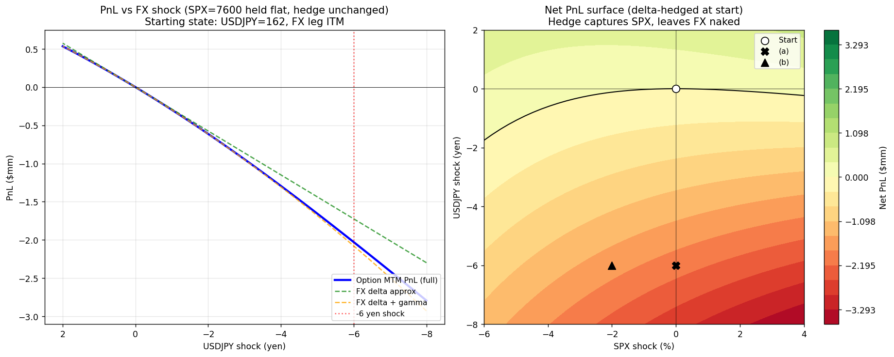

# EQ/FX Hybrid Option Pricer

Closed-form Black–Scholes pricer and risk analysis for a cross-asset hybrid:

> **An SPX call that pays only if USDJPY is above a barrier at expiry.**

$$
V_T = \max(S_T - K, 0) \cdot \mathbf{1}\{X_T > B\}
$$

This repo contains:

- A bivariate Black–Scholes closed-form pricer ([`src/hybrid_pricer.py`](src/hybrid_pricer.py))
- Monte Carlo cross-check
- Bump-and-revalue Greeks (incl. cega, cross-gamma, cross-vega)
- Seven analysis scripts producing the figures discussed below

---

## Why this trade is interesting

A vanilla SPX call costs you the full premium regardless of FX. By making the payoff contingent on `USDJPY > B`, the buyer pays **roughly 60% of the vanilla premium** in exchange for accepting the joint-event risk. The seller takes on three intertwined exposures:

1. SPX risk (delta, gamma, vega, vanna)
2. FX risk (delta, gamma, vega — but the FX vega **flips sign at the barrier**)
3. **Correlation risk**, which is unhedgeable with vanilla products

The structure looks tame on paper but the cross-Greeks make it operationally subtle. The analysis below quantifies why.

---

## The model

Under the domestic risk-neutral measure $\mathbb{Q}^d$:

$$
\frac{dS}{S} = (r_d - q)\,dt + \sigma_S\,dW^S, \qquad
\frac{dX}{X} = (r_d - r_f)\,dt + \sigma_X\,dW^X, \qquad
d\langle W^S, W^X\rangle = \rho\,dt
$$

The price is:

$$
V_0 = S_0 e^{-qT}\, M_2\!\left(d_1^S,\; d_2^X + \rho\sigma_S\sqrt{T};\; \rho\right)
   - K e^{-r_d T}\, M_2\!\left(d_2^S,\; d_2^X;\; \rho\right)
$$

where $M_2(\cdot,\cdot;\rho)$ is the standard bivariate normal CDF and the $d$-terms are defined as in standard BS, with $X$ versions referencing the FX barrier $B$. The first term comes from a numeraire change to $S$, which shifts the FX log-mean by $\rho\sigma_S\sigma_X T$.

The closed form agrees with Monte Carlo to within standard error (see `tests/test_hybrid.py`).

---

## Example trade

Throughout the analysis we use:

| | |
|---|---|
| Notional | **$100mm** |
| SPX | spot 7200, strike 7000 (~2.9% ITM) |
| USDJPY | spot 156, barrier 160 (~2.6% above spot) |
| Tenor | 6 months |
| Vols | σ_SPX = 16%, σ_FX = 10% |
| Rates | USD 4.5%, JPY 0.5%, SPX div 1.5% |
| Correlation | ρ = 0.30 |

Run `python scripts/01_trade_summary.py` to get:

```
Premium per SPX:        $288.26
Premium %:              4.00%
Premium $ (100mm):      $4.00mm
Vanilla equivalent:     $6.79mm
Hybrid / Vanilla:       58.9%
P(joint exercise):      33.1%
P(USDJPY > B):          45.6%
```

---

## Key Greeks dynamics

### 1. SPX delta is well-behaved — but the *hedge size depends on FX*



Delta has the familiar S-shape but is uniformly compressed by the FX barrier probability. The hedge size on $100mm notional ranges from **$20mm short SPX** when USDJPY=150 to **$50mm short SPX** when USDJPY=162 — at the same SPX spot. A 6-yen FX rally roughly *doubles* the SPX hedge requirement. This is the cross-gamma showing up in the static delta surface.

### 2. SPX vega is FX-conditional



Standard call-vega bell shape, but the height depends on FX spot. **Cross-vega is severe**: at the strike, vega ranges from $80k/vol pt (USDJPY=150) to $230k/vol pt (USDJPY=162). The vega book gets dramatically longer in a JPY-weakening regime — exactly when SPX vol typically goes bid.

### 3. FX vega flips sign at the barrier



The FX leg is a digital, so its vega profile is bimodal:
- **Below the barrier:** long FX vol — more volatility = better chance of breaching 160
- **Above the barrier:** short FX vol — more volatility risks falling back below
- **At the barrier:** vega is exactly zero

Magnitudes scale with SPX moneyness. At SPX=7800, FX vega exceeds **$370k/vol pt** in absolute value — bigger than the SPX vega.

### 4. Cega: bell-shaped, peaks just below the barrier



Correlation risk is maximal when **both legs are individually uncertain**. With USDJPY=156 (10% std-dev's worth of room to the barrier), correlation has the most room to swing the joint probability. As USDJPY moves to either extreme — 140 or 175 — cega collapses because one leg becomes deterministic.

At spot, **cega ≈ $30k/1% correlation on $100mm**, near the peak. A ±10 corr-point uncertainty = ±$300k of valuation gap.

### 5. The full non-trivial Greeks dashboard



Six risks that don't appear in vanilla options:
1. **Cross-gamma** ∂Δ_S/∂X — silently breaks SPX delta hedges as FX moves
2. **FX delta vs SPX** — rises with SPX moneyness (digital-shaped)
3. **Cega term structure** — concave; ranking by FX level inverts at ~1Y
4. **Cega vs ρ** — non-linear, slope sign flips with FX level
5. **SPX vanna** — magnitude grows with FX level
6. **Cross-vega** ∂ν_S/∂X — peaks below barrier, decreases past it

### 6. Scenario PnL: deep ITM, delta-hedged, sharp FX shock



Starting state: SPX=7600 (deep ITM), USDJPY=162 (FX leg ITM), delta-hedged with $58mm short SPX.

Shock: USDJPY drops 6 yen to 156 (FX leg flips OTM).

| Scenario | Option PnL | SPX hedge PnL | **Net PnL** |
|---|---|---|---|
| FX −6, SPX flat | −$2.03mm | $0 | **−$2.03mm** |
| FX −6, SPX −2% | −$2.84mm | +$1.16mm | **−$1.68mm** |
| FX −6, SPX −4% | −$3.60mm | +$2.32mm | **−$1.28mm** |

**The SPX delta hedge is useless against an FX-only move.** A 6-yen JPY rally — a single liquid trading day in the pair — wipes out 26% of MTM despite a "perfect" delta hedge. The takeaway is structural: a hybrid needs hybrid hedges. Vanilla SPX optionality cannot offset losses driven by the FX leg's digital sensitivity to its own spot.

---

## Repository layout

```
eq-fx-hybrid/
├── src/
│   ├── hybrid_pricer.py     # closed-form + MC + Greeks
│   └── trade_config.py      # example trade defaults
├── scripts/
│   ├── 01_trade_summary.py
│   ├── 02_spx_vega.py
│   ├── 03_spx_delta.py
│   ├── 04_fx_vega.py
│   ├── 05_cega.py
│   ├── 06_greeks_dashboard.py
│   ├── 07_scenario.py
│   └── run_all.py
├── notebooks/
│   └── walkthrough.ipynb    # interactive walkthrough of all of the above
├── tests/
│   └── test_hybrid.py
├── figures/                 # generated by scripts
├── requirements.txt
└── README.md
```

## Running

```bash
pip install -r requirements.txt

python scripts/01_trade_summary.py
python scripts/run_all.py        # regenerate every figure
python tests/test_hybrid.py      # smoke tests
jupyter notebook notebooks/walkthrough.ipynb
```

---

## Caveats

The bivariate BS gives clean Greeks and a good benchmark, but a real desk would layer on:

1. **SPX skew.** Calls struck OTM should be priced off the SPX surface, not flat ATM vol.
2. **FX skew.** Barrier digitals are extremely sensitive to wing vol; in production, replicate the digital as a tight call spread on the FX surface.
3. **Correlation skew.** Empirically, SPX/USDJPY correlation rises in risk-off (when SPX falls and JPY strengthens). Constant ρ likely understates the price.
4. **Stochastic vol.** Long-dated FX barriers especially benefit from a 2-factor SLV with correlated Brownians.

Treat this code as a teaching benchmark and risk-attribution tool, not a production mark.

---

## References

- Heynen & Kat (1994), "Crossing Barriers" — dual-digital and outside-barrier formulas
- Haug, *Complete Guide to Option Pricing Formulas* — multi-asset closed forms
- Lipton, *Mathematical Methods for Foreign Exchange* — quanto and FX hybrid mechanics

## License

MIT — see [LICENSE](LICENSE).
